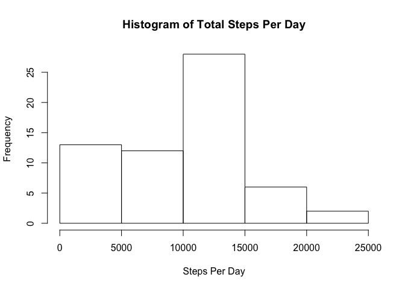
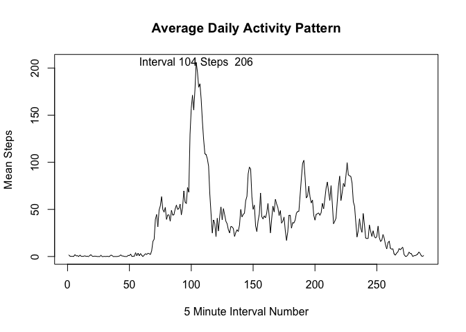
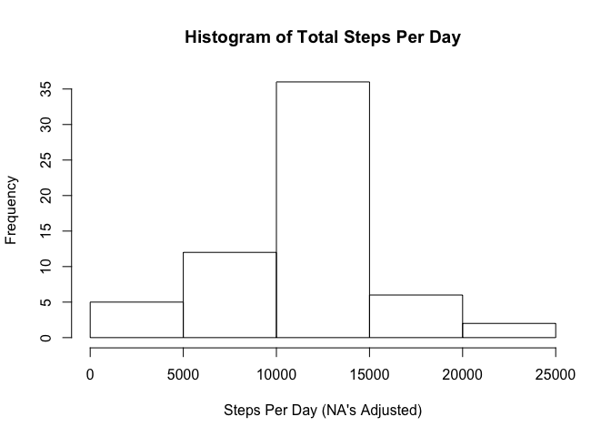
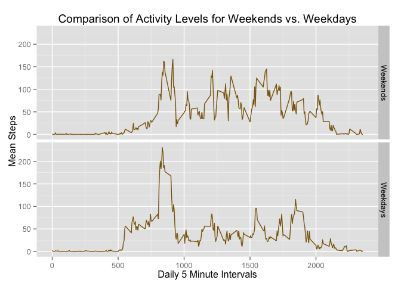

# Reproducible Research: Peer Assessment 1


## Loading and preprocessing the data

####Background

It is now possible to collect a large amount of data about personal movement using activity monitoring devices such as a Fitbit, Nike Fuelband, or Jawbone Up. These type of devices are part of the “quantified self” movement – a group of enthusiasts who take measurements about themselves regularly to improve their health, to find patterns in their behavior, or because they are tech geeks. But these data remain under-utilized both because the raw data are hard to obtain and there is a lack of statistical methods and software for processing and interpreting the data.

This assignment makes use of data from a personal activity monitoring device. This device collects data at 5 minute intervals through out the day. The data consists of two months of data from an anonymous individual collected during the months of October and November, 2012 and include the number of steps taken in 5 minute intervals each day.

Read the data into a dataframe and attach the dataframe:


```r
# Please be sure you set the working directory to where the activity.csv file exists

peerdf <- read.csv("activity.csv")
```


## What is mean total number of steps taken per day?

Calculations for Total Steps per Day and Histogram.
Total Steps Per Day, Mean of Total Steps/Day, Median of Total Steps/Day


```r
tstepsday <- tapply(peerdf$steps, peerdf$date, sum, na.rm=TRUE)
m1tstepsday <- mean(tstepsday)
m2tstepsday <- median(tstepsday)

hist(tstepsday, main="Histogram of Total Steps Per Day", xlab="Steps Per Day")
```

 

#####The mean of the total steps per day = 9354.23
#####The median of the total steps per day = 10395


## What is the average daily activity pattern?

Calculation for total steps per interval (averaged across all days):

```r
mstepsinterval <- tapply(peerdf$steps, peerdf$interval, mean, na.rm=TRUE)
maxmeanindex <- which.max(mstepsinterval)
valmax <- mstepsinterval[maxmeanindex]
missing <- nrow(peerdf) - sum(complete.cases(peerdf))
showmax <- paste("Interval", as.character(maxmeanindex), "Steps ", as.character(round(valmax)), sep=" ")

plot(mstepsinterval, type="l", main="Average Daily Activity Pattern", ylab="Mean Steps", xlab="5 Minute Interval Number")
text(maxmeanindex, valmax, showmax)
```

 

##### As denoted on the plot, the maximum value occurred in Interval 104
##### The maximum of the average steps (rounded) was 206


## Imputing missing values

#####The number of rows with missing values is 2304

To handle the missing values, a new dataset is created that is equal to the original dataset but the missing values have been filled in.  The strategy for filling in all of the missing values is to use the the mean for that 5-minute interval.  Using the new dataset, a histogram is presented of the total number of steps taken each day.


```r
library(reshape2)
temp <- melt(mstepsinterval, varnames="interval", value.name="intmean")

mergedf <- merge(peerdf, temp, by="interval")

for (i in 1:nrow(mergedf)) {
  if (is.na(mergedf$steps[i]) == TRUE) {
    mergedf$steps[i] <- mergedf$intmean[i]
  }
}

## Make a histogram of the total number of steps taken each day.  Calculate the mean and median total number of steps taken per day.

tstepsday2 <- tapply(mergedf$steps, mergedf$date, sum, na.rm=TRUE) ##should not be any NA
m1tstepsday2 <- mean(tstepsday2)
m2tstepsday2 <- median(tstepsday2)

## Calculations for the differences from the original analysis
diffsumpc <- (sum(tstepsday2)-sum(tstepsday))/ sum(tstepsday) * 100
diffmeanpc <- (m1tstepsday2 - m1tstepsday)/ m1tstepsday * 100
diffmedpc <- (m2tstepsday2 - m2tstepsday)/ m2tstepsday * 100

hist(tstepsday2, main="Histogram of Total Steps Per Day", xlab="Steps Per Day (NA's Adjusted)")
```

 


#####The adjusted mean of the total steps per day = 10766.19
#####The adjusted median of the total steps per day = 10766

The adjusted mean and median differ from the estimates with the NA values excluded.  Substituting the mean of the interval period that corresponds to the NA values results in the mean and median increasing.   

The difference in the adjusted mean and the original mean of the total steps per day = 1412 steps or 15.09 %.  
The difference in the adjusted median and the original median of the total steps per day = 371 steps or 3.571 %.  


## Are there differences in activity patterns between weekdays and weekends?


```r
# Create day of week in numeric format, easier to work with (0=Sunday)
mergedf$wd <- as.POSIXlt(mergedf$date,format="%Y-%m-%d")$wday
mergedf$wdy <- as.factor(mergedf$wd >= 1 & mergedf$wd <= 5)

# Recalculate mean for each interval based on weekday/weekend groups
splitdf <- split(mergedf, mergedf$wdy)
meanswe <- with(splitdf[[1]], tapply(steps, interval, mean)) #weekend
meanswd <- with(splitdf[[2]], tapply(steps, interval, mean)) #weekday

# Merge df's back with new interval means for weekend
temp1 <- melt(meanswe, varnames="interval", value.name="intmeannew")
tempdf1 <- merge(splitdf[[1]], temp1, by="interval")

# Merge df's back with new interval means for weekday
temp2 <- melt(meanswd, varnames="interval", value.name="intmeannew")
tempdf2 <- merge(splitdf[[2]], temp2, by="interval")

resultdf <- rbind(tempdf1, tempdf2) 
levels(resultdf$wdy)[levels(resultdf$wdy)=="TRUE"] <- "Weekdays"
levels(resultdf$wdy)[levels(resultdf$wdy)=="FALSE"] <- "Weekends"

library(ggplot2)
ggplot(resultdf, aes(interval, intmeannew)) +
  geom_line(color="darkgoldenrod4") + 
  facet_grid(wdy ~ .) +
  ggtitle("Comparison of Activity Levels for Weekends vs. Weekdays") + 
  xlab("Daily 5 Minute Intervals") +
  ylab("Mean Steps")
```

 
